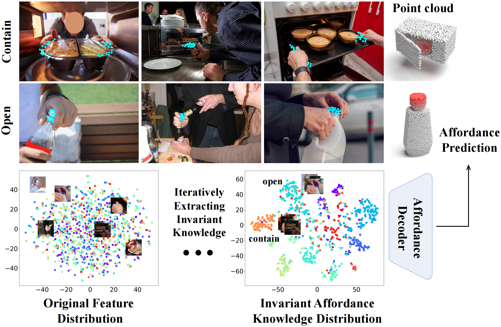

<p align="center">
<h1 align="center"><strong>Learning 2D Invariant Affordance Knowledge for 3D Affordance Grounding</strong></h1>
</p>

<div id="top" align="center">

**AAAI 2025**

[](https://arxiv.org/abs/2408.13024)
[](https://goxq.github.io/mifag/)

</div>

## Motivation

Existing image-guided 3D affordance grounding methods rely on a single human-object interaction image and can overfit to its appearance and geometry. **MIFAG** instead extracts the interaction patterns shared by multiple images of the same affordance, stores them as invariant affordance knowledge, and adaptively fuses this knowledge with point-cloud features for more generalizable 3D affordance grounding.

<p align="center">
  
</p>

## Setup

```bash
pip install -r requirements.txt

# Download the ImageNet-pretrained ResNet-18 weights used for training
mkdir -p pretrained
python -c "import torch; from torchvision.models import resnet18, ResNet18_Weights; torch.save(resnet18(weights=ResNet18_Weights.DEFAULT).state_dict(), 'pretrained/resnet18.pth')"
```

To use another ResNet-18 checkpoint, pass its path with `--resnet18_path`.

## Data Preparation

Download the PIAD dataset by following the [IAGNet data download instructions](https://github.com/yyvhang/IAGNet/tree/master#download-piad-and-the-model-checkpoint-). Place the downloaded images and point clouds under `Data/Seen/` and `Data/Unseen/`. The MIPA split files used by this project are provided in `data/mipa_splits/`.

## Training

```bash
# Seen setting
bash scripts/train_seen.sh

# Unseen setting
bash scripts/train_unseen.sh
```

For a custom dataset root, append `--data_root /path/to/mipa_root`. Checkpoints are saved under `runs/train/`.

## Evaluation

Download the pretrained checkpoints and evaluate the seen or unseen setting with:

```bash
bash scripts/eval_seen.sh /path/to/mifag_mipa_seen.pt
bash scripts/eval_unseen.sh /path/to/mifag_mipa_unseen.pt
```

The evaluation reports AUC, aIOU, SIM, and MAE.

## Pretrained Checkpoints

Both checkpoints use the full MIFAG model (IAM + ADM) with two reference images. The seen model uses four IAM layers, while the unseen model uses six IAM layers.

| Setting | Checkpoint | AUC | aIOU | SIM | MAE |
| --- | --- | ---: | ---: | ---: | ---: |
| Seen | [Download](https://huggingface.co/goxq/mifag_mipa_resnet18/resolve/main/mifag_mipa_seen.pt?download=true) | 0.8510 | 0.2050 | 0.5681 | 0.0912 |
| Unseen | [Download](https://huggingface.co/goxq/mifag_mipa_resnet18/resolve/main/mifag_mipa_unseen.pt?download=true) | 0.7113 | 0.0523 | 0.3148 | 0.1358 |

## Acknowledgements

This codebase is built upon the official [IAGNet](https://github.com/yyvhang/IAGNet) implementation. We thank the authors for releasing their code and the PIAD dataset.

## Citation

If you find this work useful, please cite:

```bibtex
@inproceedings{gao2025mifag,
  title={Learning 2d invariant affordance knowledge for 3d affordance grounding},
  author={Gao, Xianqiang and Zhang, Pingrui and Qu, Delin and Wang, Dong and Wang, Zhigang and Ding, Yan and Zhao, Bin},
  booktitle={Proceedings of the AAAI Conference on Artificial Intelligence},
  volume={39},
  number={3},
  pages={3095--3103},
  year={2025}
}
```
